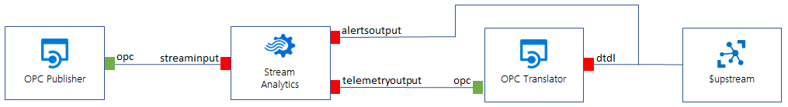

# IoT Edge

[Azure IoT Edge](https://docs.microsoft.com/en-us/azure/iot-edge/about-iot-edge) is an implementation that moves cloud analytics and custom business logic closer to IoT devices. This can be done for multiple reasons: responding to emergencies as quickly as possible, running anomaly detection workloads at the edge, reducing bandwidth costs and transferring large amounts of raw data, performing data cleaning and aggregation locally before sending it to the cloud for further analysis.

This solution uses an Ubuntu 18.04 virtual machine to simulate what would be a real IoT edge device deployed next to the data sources.


## IoT Edge modules

This IoT edge implementation consists of 3 edge modules: [OPC Publisher](./OpcPublisher.md), Azure Stream Analytics Edge [job](./EdgeASA.md) and [OPC translator](./OpcTranslator.md).


## IoT Edge deployment

IoT Edge automatic deployments allow management of many ongoing devices at scale. Automatic deployments for IoT Edge are part of the [automatic device management](https://docs.microsoft.com/en-us/azure/iot-hub/iot-hub-automatic-device-management) feature of IoT Hub. Deployments are dynamic processes that enable you to deploy multiple modules to multiple devices, track the status and health of the modules, and make changes when necessary.

For more information, see [Understand IoT Edge automatic deployments for single devices or at scale](https://docs.microsoft.com/en-us/azure/iot-edge/module-deployment-monitoring).


### IoT Edge deployment manifest

The *deployment manifest* is a JSON document that describes:

- The **IoT Edge agent** module twin, which includes three components:
  - The container image for each module that runs on the device.
  - The credentials to access private container registries that contain module images.
  - Instructions for how each module should be created and managed.
- The **IoT Edge hub** module twin, which includes how messages flow between modules and eventually to IoT Hub.
- The desired properties of any additional module twins (optional).

All IoT Edge devices must be configured with a deployment manifest. A newly installed IoT Edge runtime reports an error code until configured with a valid manifest. More information regarding deployment manifests can be found [here](https://docs.microsoft.com/en-us/azure/iot-edge/module-composition).

In this repository, the [deployment template](../EdgeSolution/modules/OPC/layered.deployment.template.json) is used to describe the modules `$edgeHub`, `$edgeAgent`, `opcPublisher`, `streamAnalytics` and `opcToDtdl`. In order to create the deployment manifest, the template must be updated with the Azure Stream Analytics edge job module information, explained [here](./EdgeASA.md).

Once the edge job is published, the following template content is replaced:

- *____ASA_ENV____* is replaced with the *env* settings from the edge job published information
- *____ASA_INPUT_NAME____*  is replaced with the first edge job input name
- *____ASA_DESIRED_PROPERTIES____* is replaced with the edge job desired properties payload


### IoT Edge routes

The IoT Edge hub manages communication between modules, IoT Hub, and any leaf devices. Therefore, the $edgeHub module twin contains a desired property called *routes* that declares how messages are passed within a deployment. You can have multiple routes within the same deployment. Find more about declaring routes [here](https://docs.microsoft.com/en-us/azure/iot-edge/module-composition#declare-routes).


Below is the route section of the IoT Edge hub's desired properties and a graphical representation of the routes defined in this solution:

```json
"routes": {
  "PublisherToStreamAnalytics": "FROM /messages/modules/opcPublisher/* INTO BrokeredEndpoint(\"modules/streamAnalytics/input/streaminput\")",
  "StreamAnalyticsToTranslator": "FROM /messages/modules/streamAnalytics/outputs/telemetryoutput INTO BrokeredEndpoint(\"modules/opcToDtdl/inputs/opc\")",
  "TranslatorToHub": "FROM /messages/modules/opcToDtdl/outputs/dtdl INTO $upstream",
  "StreamAnalyticsToHub": "FROM /messages/modules/streamAnalytics/outputs/alertsoutput INTO $upstream"
}
```




### Identify devices using tags

Before you can create a deployment, you have to be able to specify which devices you want to affect. Azure IoT Edge identifies devices using **tags** in the [device twin](https://docs.microsoft.com/en-us/azure/iot-hub/iot-hub-devguide-device-twins). Each device can have multiple tags that you define in any way that makes sense for your solution.


In this solution, when the IoT edge device is deployed using Device Provisioning Service, it gets the following tags in its device twin:

```json
"tags": {
  "os": "Linux",
  "__type__": "iiotedge"
}
```

The device twin tag `__type__` is later used to create the layered deployment in the IoT edge device in the [deployment script](../Scripts/deploy.ps1#L284).

