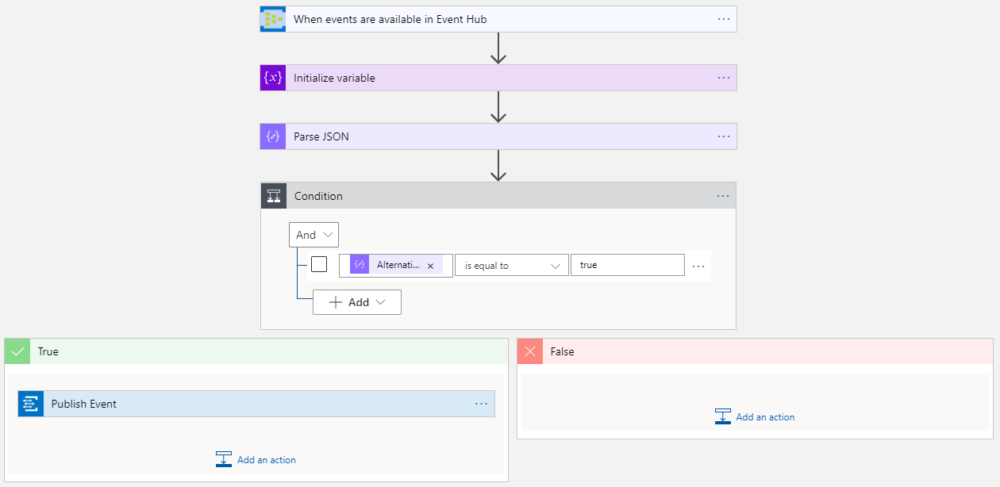
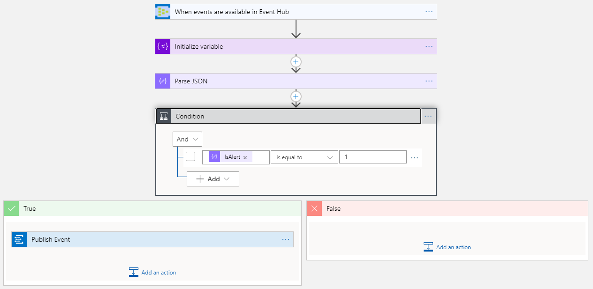

# Notification and Alerting

Very often in IoT solutions, it is important to receive notifications whenever certain tasks complete or systems reach a threshold. Those notifications can trigger business processes, generate automated actions to calibrate or even stop production to avoid bigger failures. We already discussed in the Azure Stream Analytics Cloud [section](/CloudASA.md) that telemetry events labeled as alerts are sent to the `alerts` event hub and telemetry events where the tag `AlternatingBoolean` is set to true are sent to the `notifications` event hub. In this section we will discuss how to handle those events using [Logic Apps](https://docs.microsoft.com/en-us/azure/logic-apps/logic-apps-overview).


[Azure Logic Apps](https://docs.microsoft.com/en-us/azure/logic-apps/logic-apps-overview) is a cloud service that helps you schedule, automate, and orchestrate tasks, business processes, and [workflows](https://docs.microsoft.com/en-us/azure/logic-apps/logic-apps-overview#logic-app-concepts) when you need to integrate apps, data, systems, and services across enterprises or organizations. Logic Apps simplifies how you design and build scalable solutions for app [integration](https://azure.microsoft.com/product-categories/integration/), data integration, system integration, enterprise application integration (EAI), and business-to-business (B2B) communication, whether in the cloud, on premises, or both.


Every logic app workflow has two main components: triggers and actions. Triggers fire  when a specific event occurs, or when new available data meets specific requirements. Each time that the trigger fires, the Logic Apps engine creates a logic app instance that runs the actions in the workflow. These actions can also include data conversions and workflow controls, such as conditional statements, switch statements, loops, and branching. In our case, we have two Logic App solutions, [NotificationsApp](../LogicApps/NotificationsApp) and [AlertsApp](../LogicApps/AlertsApp). For both of them the trigger is whenever there are new events in [Azure Event Hubs](https://docs.microsoft.com/en-us/azure/event-hubs/event-hubs-about), and the main action is to send a message via Azure [Event Grid](https://docs.microsoft.com/en-us/azure/event-grid/overview).


> [!NOTE:] Both Logic Apps solutions were created using the latest Azure Logic Apps Tools for Visual Studio, since it provides the same logic app designed view as in the Azure Portal, but you can also keep your solution in your code repository. For more details about how to install and use the Azure Logic Apps Tools for Visual Studio, take a look at this [document](https://docs.microsoft.com/en-us/azure/logic-apps/quickstart-create-logic-apps-with-visual-studio).


## Notifications App workflow




In this workflow, whenever new events are available in the `notifications` Event Hub, certain actions take place to do the following:

- Initialize a variable with the event's content
- Parse the event's content in JSON format using the following schema:

```json
{
  "properties": {
    "AlternatingBoolean": {
      "type": "boolean"
    },
    "ApplicationUri": {
      "type": "string"
    },
    "NodeId": {
      "type": "string"
    },
    "SourceTimestamp": {
      "type": "string"
    },
    "Status": {
      "type": "string"
    }
  },
  "type": "object"
}
```

- Evaluate whether the property `AlternatingBoolean` is equal to `true`. If so:
- Send a message like the one blow to an Event Grid topic to be broadcasted to all its subscriptions:

```json
{
  "id": "__connection_device_id__/__application_uri__/__node_id__",
  "subject": "IoT Notification",
  "eventType": "Notification",
  "data": {
    "AlternatingBoolean": true
  },
  "dataVersion": "",
  "metadataVersion": "1",
  "eventTime": "__source_timestamp__",
  "topic": "/subscriptions/__subscription__/resourceGroups/__resource_group__/providers/Microsoft.EventGrid/topics/__event_grid_topic__"
}
```


If you set up your webhook using [Webhook.site](https://webhook.site/) like it was suggested during the [Pre-requisites](../README.md), you should see events coming in like this one:


You can take a look at the full Visual Studio solution [here](../LogicApps/NotificationsApp).


## Alerts App workflow




Similarly, when new events are available in the `alerts` Event Hub, certain actions take place to do the following:

- Initialize a variable with the event's content
- Parse the event's content in JSON format using the following schema:

```json
{
  "type": "object",
  "properties": {
    "NodeId": {
        "type": "string"
    },
    "ApplicationUri": {
        "type": "string"
    },
    "SourceTimestamp": {
        "type": "string"
    },
    "Tag": {
        "type": "string"
    },
    "Value": {
        "type": "number"
    },
    "IsAlert": {
        "type": "integer"
    },
    "AnomalyScore": {
        "type": "number"
    },
    "ConnectionDeviceId": {
        "type": "string"
    }
  }
}
```

- Evaluate whether the property `IsAlert` is equal to `1`. If so, then:
- Send a message like the one blow to an Event Grid topic to be broadcasted to all its subscriptions:

```json
[
  {
    "id": "__connection_device_id__/__application_uri__/__node_id__",
    "subject": "IoT Notifications",
    "eventType": "Alert",
    "data": {
      "Tag": "__tag__",
      "Value": __value__,
      "Score": __score__
    },
    "dataVersion": "",
    "metadataVersion": "1",
    "eventTime": "__source_timestamp__",
    "topic": "/subscriptions/__subscription__/resourceGroups/__resource_group__/providers/Microsoft.EventGrid/topics/__event_grid_topic__"
  }
]
```


Once again, you should see events coming in like this one:


You can take a look at the full Visual Studio solution [here](../LogicApps/AlertsApp).