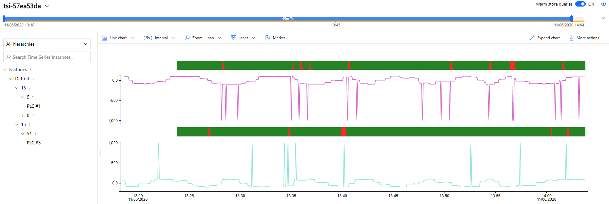

# Real-time data visualization with Azure Time Series Insights

[Azure Time Series Insights](https://docs.microsoft.com/en-us/azure/time-series-insights/overview-what-is-tsi) is an open and scalable end-to-end IoT analytics service that you can use to collect, process, store, query and visualize data at Internet of Things (IoT) scale--data that's highly contextualized and optimized for time series. It is designed for ad hoc data exploration and operational analysis allowing you to uncover hidden trends, spotting anomalies, and conduct root-cause analysis.

The following diagram shows the high-level data flow:

> [!IMPORTANT:] There are two versions of Time Series Insights: Gen1 and Gen2. The service we are referring to in this tutorial is Gen2.

Azure Time Series Insights  supports data collection from IoT Hub and Event Hubs, and supports up to two data sources. In this tutorial, Azure Time Series Insights is connected to the `telemetry` and `alerts` event hubs because we want to demonstrate how data from different sources can be correlated and visualized together.

> [!NOTE:] We could have connected the service directly to IoT Hub and explore raw data, but we preferred to use event hubs to aggregate data with a few properties and take care of any case sensitive inconsistencies, you may do what is best for your use case.

## Time Series Model

Azure Time Series Insights provides a tools to model data that simplifies finding and analyzing time series data. It achieves this objective by enabling the curation, maintenance, and enrichment of time series data to help prepare consumer-ready datasets for analytics.

Time Series Model has three core components:

- [Time Series Model instances](https://docs.microsoft.com/en-us/azure/time-series-insights/concepts-model-overview#time-series-model-instances)
- [Time Series Model hierarchies](https://docs.microsoft.com/en-us/azure/time-series-insights/concepts-model-overview#time-series-model-hierarchies)
- [Time Series Model types](https://docs.microsoft.com/en-us/azure/time-series-insights/concepts-model-overview#time-series-model-types)

This tutorial creates a fictitious model that consists on a `PLC` model type (a combination of telemetry and alert data) and a  `Factories` model hierarchy with the levels `City` -> `Building` -> `Area`. By mapping the data coming from the three OPC PLC servers, we are able to see it all working together:

The Time Series model is deployed by calling the [Add-TimeSeriesInsightsModel](../Scripts/deploy.ps1#L365) PowerShell function by leveraging the Azure Time Series Insights [Model APIs](https://docs.microsoft.com/en-us/rest/api/time-series-insights/reference-model-apis).
