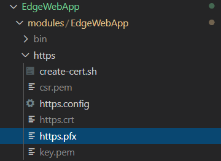

# Deploy Web Application As an IoT Edge Module

An important part of IoT Edge applications is to provide operators and workers at the edge visuals and charts to see what is happening with their machines and processes, and be able to take actions whenever needed. There are great open source solutions like Grafana to visualize charts, graphs and alerts, but in some other cases you may have your own development team that creates and maintains a custom web application for similar purposes. In this section we will explain how to deploy a web application as an IoT Edge module.


## Web Application

For this tutorial I decided to use an ASP.NET Core Web App located [here](./modules/EdgeWebApp), but the same principles will apply to other frameworks like angular, react, grpc, NodeJS, etc.


> !NOTE: You can create your own ASP.NET Core Web App using Visual Studio or via command-line with the **dotnet** library by running the command below. More information about dotnet can be found [here](https://docs.microsoft.com/en-us/dotnet/core/tools/dotnet-new).


```bash
dotnet new webapp -o <app-location>
```


## HTTPS Support

In case you want to access your application via https, you will need a server certificate to provide the application. In a production environment this certificate will usually by signed by a trusted authority. In this tutorial I created a self-signed certificate by following these steps:


1. (OPTIONAL) Open the config file [https.config](./modules/EdgeWebApp/https/https.config) and edit the `commonName` in line 13 to your own preference. Save and close the file.
2. (OPTIONAL) Open the script [create-cert.sh](./modules/EdgeWebApp/https/create-cert.sh) and change the password for the PFX certificate to your own. Save and close the file.
3. Run the script [create-cert.sh](./modules/EdgeWebApp/https/create-cert.sh):

```bash
cd EdgeWebApp/modules/EdgeWebApp/https/
sh create-cert.sh
```


You will end up with some new files in the https folder like in the image below. The only one we will care about is **https.pfx**.




> !NOTE: You can also create a certificate for development purposes using `dotnet` library by running the command `dotnet dev-certs https -ep <output-path> -p <cryptic-password>`.


### Configure Kestrel to support HTTPS

> !NOTE: The information provided in this section applies only to ASP.NET Core web applications. Other platforms and languages may need different configurations.

Our web application uses Kestrel as the default web server. In order for it to support HTTPS, all that is needed is to provide the right environment configuration with the certificate information. The needed settings are detailed in the [appsettings.json](./modules/EdgeWebApp/appsettings.json) file in the following sub-section:


```json
"urls": "https://+;http://+",
"https_port": 443,
"Kestrel": {
  "Certificates": {
    "Default": {
      "Path": "",
      "Password": ""
    }
  }
}
```


While you can provide the path and password for the certificate in the `appsettings.json` file, this application will be containerized before being deployed to the edge and normally you wouldn't want to repackage your application every time you have to update the certificate. Setting up your configuration in the sub-section above either in `appsettings.json` or `appsettings.Development.json` is good when you are debugging your application locally.

Run your app in Visual Studio or running `dotnet build && dotnet run` and see if you can access your web app at https://localhost:5001 successfully and see the certificate information in your browser.


## Containerizing your app

Now that you were able to run the web app locally, it is time to containerize it and test the container. Run the commands below:

```bash
cd EdgeWebApp/modules/EdgeWebApp/
docker build -t <artifacts-login-server>/<image-name>:<image-tag> .
```


### Run the container locally

Once the container has been built, you can test it locally to make sure the app is running and that you understand how to provide the certificate information to the Docker engine. The command below will start your container in the background under the name `edgewebapp`, will map the port 5001 to your container's port 443 and the port 5000 to your container's port 80, and will also provide the environment variables Kestrel needs to implement HTTPS.

```bash
docker run \
        -d \
        --name edgewebapp \
        -p 5001:443 \
        -p 5000:80 \
        -e ASPNETCORE_HTTPS_PORT=443 \
        -e ASPNETCORE_URLS='https://+;http://+' \
        -e ASPNETCORE_Kestrel__Certificates__Default__Path='/https/https.pfx' \
        -e ASPNETCORE_Kestrel__Certificates__Default__Password='P@ssw0rd1!' \
        -v <absolute-path-to-repo>/EdgeWebApp/modules/EdgeWebApp/https/:/https/ \
        <artifacts-login-server>/<image-name>:<image-tag>
```


> !NOTE: Remember to update the certificate password if you changed the default value when creating the certificate. You must also update the full image name you used when you ran the `docker build` command.


You should be able to access your application via https://localhost:5001 and see the certificate information in your browser.


## Deploy the web application to IoT Edge

Now that your module is containerized, you are ready to deploy is as an IoT Edge module. Since this is an isolated application and there may be other modules already running in your edge device, we will use a [layered deployment](./layered.manifest.json). A few things to note in the deployment manifest:

- In the module's create options:
  - We are specifying a Hostname to tell the Docker engine to route requests to this module using `edgewebapp` as DNS name.
  - We are binding the path `/https/` in your IoT Edge device OS to the path `/https/` in your container. This is because we are providing the path `/https/https.pfx` as the location for the PFX certificate in the environment variables section (continue reading).
  - We are mapping the ports 5001 -> 443 and 5000 -> 80
- In the module's environment variables section:
  - We are specifying the certificate path and password as well as other required settings.


Follow the steps below to customize the manifest to your environment:

1. Open the file [layered.manifest.json](./layered.manifest.json)
2. In line 7, update the full image name you used when you ran the `docker build` command.
3. In line 15, update the certificate password if you changed the default value when creating the certificate.
4. Save and close the file.
5. Ensure your firewall allows connections to the IoT Edge device via ports 5000 and 5001. In my case, I am using an Azure VM as IoT Edge device, so all I did was updating the rules in the NSG (Network Security Group):


Now, run the following command to deploy your module:

```bash
cd EdgeWebApp/modules/EdgeWebApp/
az iot edge deployment create \
    --layered true \
    --priority <highest-priority> \
    --deployment-id edgewebapp-<highes-priority> \
    --hub-name <hub-name> \
    --target-condition "<tags-target-condition>" \
    --content layered.manifest.json
```


> !NOTE: Remember to update the priority of your module to the highest number in your list. You must also update the name of your IoT Hub and the target conditions, for example `'tags.__type__="iiotedge"'`.


After a few minutes of launching your deployment, the module should be up and running and you will be able to access the web app using the IP address or DNS of the IoT Edge device via port 5001, for example https://linuxgateway-1.eastus.cloudapp.azure.net:5001/.

